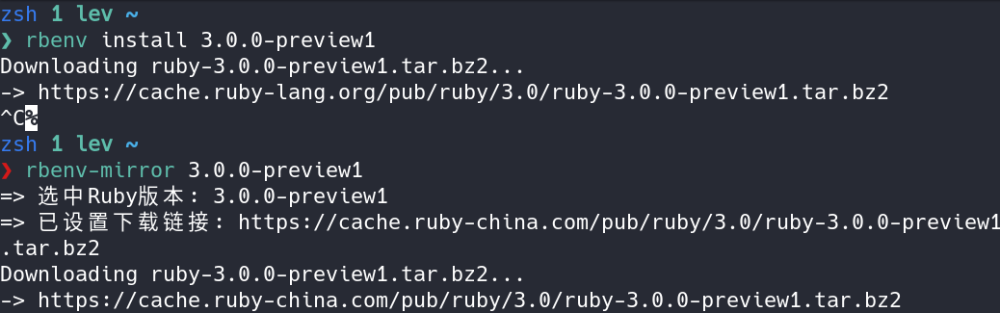

## 介绍

详情参考 [Ruby China的帖子](https://ruby-china.org/topics/40693)

`rbenv` (plus `ruby-build`)国内安装脚本,保证不需要任何外网,依然可以体验到最新的Ruby.

已在本地和国内服务器上测试。

支持Bash, Zsh 暂不支持Fish, PowerShell

镜像提示：

1. 🥳 rbenv每周五晚九点强制准时更新
2. 🥰 ruby-build已由Gitee官方镜像管理,每天更新,这是管理Ruby版本的真正仓库,所以不用担心更新不及时

`ruby-build` 并不检查编译环境，需要手动先安装好。请先查看下方的编译依赖。
[编译依赖](https://github.com/rbenv/ruby-build/wiki#suggested-build-environment)

## 使用方法

```bash
# 除了rbenv,额外添加了两个命令 `rbenv-update` 和 `rbenv-mirror`

# 当有新Ruby版本出现时,使用rbenv-update来同时更新 rbenv 和 ruby-build 插件
rbenv-update

# 查看支持的Ruby版本
rbenv install -l 或 -L 

# 当需要使用国内镜像时(国内用户总是需要这么做),此命令自动从Ruby China上下载该版本Ruby
# 该命令用来替换常见的 rbenv install 3.0.0-preview2
rbenv-mirror 3.0.0-preview2

```

使用前后对比如图:


## 一键安装
```shell
bash -c "$(curl -fsSL https://gitee.com/RubyKids/rbenv-cn/raw/master/install.sh)"
```

## 一键卸载
```shell
bash -c "$(curl -fsSL https://gitee.com/RubyKids/rbenv-cn/raw/master/uninstall.sh)"
```

## Gem换源
```bash
gem source -r https://rubygems.org/ 
gem source -a https://gems.ruby-china.com 

# Bundler change source
bundle config 'mirror.https://rubygems.org' 'https://gems.ruby-china.com' 
```